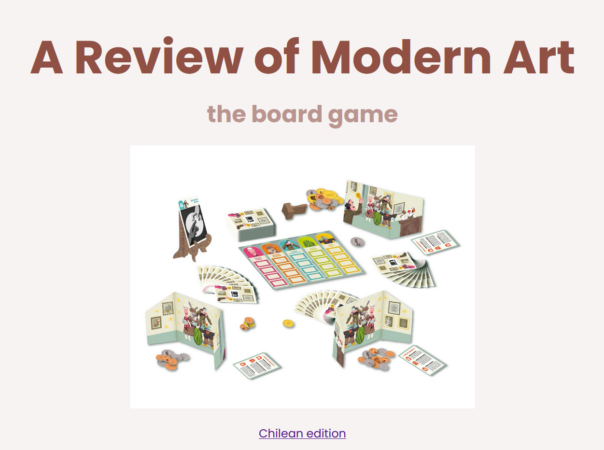

# HTML practice

I decided to write a review about the board game Modern Art. I was relatively confident in my abilities to use CSS and HTML, although practicing it shows I still have some parts I could improve on a lot.

Where I found the images:
https://boardgamegeek.com/image/7243395/modern-art
https://boardgamegeek.com/image/9409015/gaminglibraryph
https://boardgamegeek.com/image/3200087/modern-art
https://boardgamegeek.com/image/3833818/modern-art